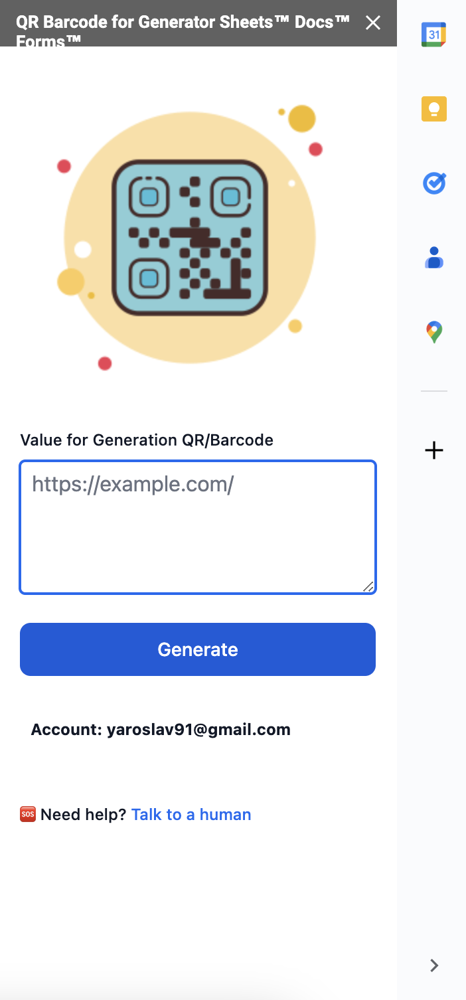

Last updated: Aug 30, 2023

**The personal information you disclose to us**

In Short: We collect personal information that you provide to us.

Since our Google add-ons only work with Google products, a Google account is required for authentication and login. Our Google add-ons collect your email address for the first authentication in the application. Authentication is performed by Google itself using the default authentication method. Our add-ons, without this authentication, will not work properly. Authentication can be revoked by the user at any time. In order to provide services to you, your email address must be used to send you communications, such as confirmation emails and support updates

Your email address will be used to activate your license.

**We do not share, track or sell your personal and business information to third parties.**

**HOW DO WE KEEP YOUR INFORMATION SAFE?**

In Short: We aim to protect your personal information through a system of organizational and technical security measures.

We have implemented appropriate technical and organizational security measures designed to protect the security of any personal information we process. However, despite our safeguards and efforts to secure your information, no electronic transmission over the Internet or information storage technology can be guaranteed to be 100% secure. QR Barcode for Generator Sheets™ Docs™ Forms™ uses and transfers to any other app of information received from Google API’s will to [Google API Services User Data Policy](https://developers.google.com/terms/api-services-user-data-policy#additional_requirements_for_specific_api_scopes), including the Limited Use requirements.

We do not store your data (inputs, clicks, or drive files). It stays on Google’s servers. Granting us access to your data does not allow us to access it offline. This access is only used for displaying your information on the app and for taking actions on your behalf. All the actions performed come from you.

The only information we store from your Google account is your name, last name, profile picture, and e-mail.

We do not share your data with any third party.

The QR Barcode for Generator Sheets™ Docs™ Forms™ use and transfer of information received from Google APIs adheres to [Google API Services User Data Policy](https://developers.google.com/terms/api-services-user-data-policy#additional_requirements_for_specific_api_scopes), including the Limited Use requirements.

This Privacy Policy describes Our policies and procedures on the collection, use and disclosure of Your information when You use the Service and tells You about Your privacy rights and how the law protects You.

### Which permissions are needed for "QR Barcode for Generator Sheets™ Docs™ Forms™"?

When you use "QR Barcode for Generator Sheets™ Docs™ Forms™" for the first time, you’ll be asked to accept the minimum-required permissions:

| Required permission                                                                        | Explanation of usage                                                                                 |
|--------------------------------------------------------------------------------------------|------------------------------------------------------------------------------------------------------|
| Display and run third-party web content in prompts and sidebars inside Google applications | To show custom UI in the Google Workspace editor or other Google Workspace applications.             |
| Connect to an external service                                                             | We need to request data at an external service, specifically for getting a response from AI service. |

Also it uses scope https://www.googleapis.com/auth/userinfo.email for identifying you at the backend part.

The add-on could be executed in Google Sheets™, Docs™, Forms™ - it has pretty similar functionality.

### Google Sheets™ Version

The add-on in Google Sheets™ has the following fields:
- QR/Barcode Values
- Labels
- Generate code into

Content of the fields will be sent to our server to generate QR Code images.
- We have implemented appropriate technical and organizational security measures designed to protect the security of any personal information we process.
- We do not share this information.
- We do not store this information on our server.
- We use HTTPS to protect transferring the content.
- it uses scope https://www.googleapis.com/auth/userinfo.email for identifying you at the backend part.

### Google Docs™ Version

The add-on in Google Docs™ has the following fields:
- Value for generation QR/Barcode

Content of the fields will be sent to our server to generate QR Code images.
- We have implemented appropriate technical and organizational security measures designed to protect the security of any personal information we process.
- We do not share this information.
- We do not store this information on our server.
- We use HTTPS to protect transferring the content.
- it uses scope https://www.googleapis.com/auth/userinfo.email for identifying you at the backend part.

### Google Forms™ Version

The add-on in Google Forms™ has the following fields:
- The add-on takes only public url to current Google Form™ and send it to out backend to generate QR Image 

Content of the fields will be sent to our server to generate QR Code images.
- We have implemented appropriate technical and organizational security measures designed to protect the security of any personal information we process.
- We do not share this information.
- We do not store this information on our server.
- We use HTTPS to protect transferring the content.
- it uses scope https://www.googleapis.com/auth/userinfo.email for identifying you at the backend part.

### Why does "QR Barcode for Generator Sheets™ Docs™ Forms™" need those permissions?

"QR Barcode for Generator Sheets™ Docs™ Forms™" is integrated with G Suite apps like Sheets. It requires access to the Google environment to provide services seamlessly across the G Suite apps. "QR Barcode for Generator Sheets™ Docs™ Forms™" only requests the minimum-required permissions that are essential for it to function optimally.

"QR Barcode for Generator Sheets™ Docs™ Forms™" does not have access to your Google account or your password, only to your email  info. We do not share your email.

### Still have questions?

Please contact by email: yaroslav91@gmail.com and will be happy to help you.
Also you can contact by a chat at the bottom.